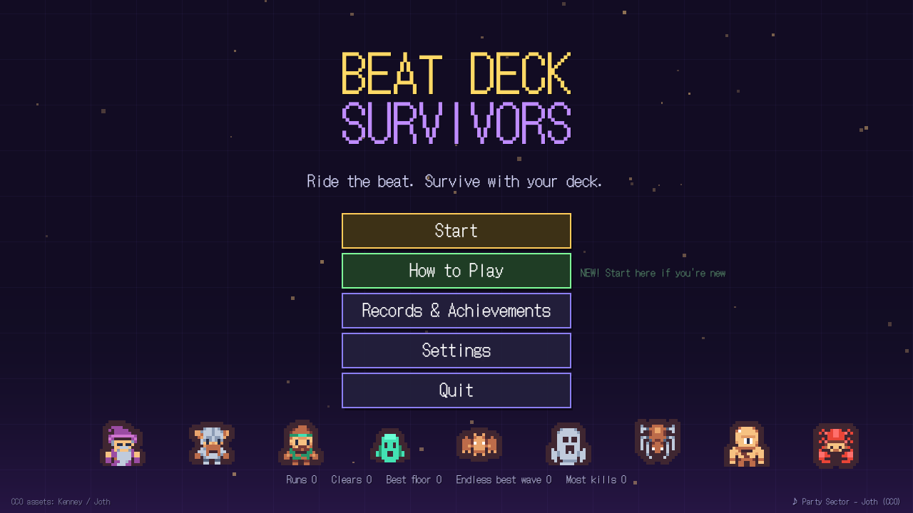
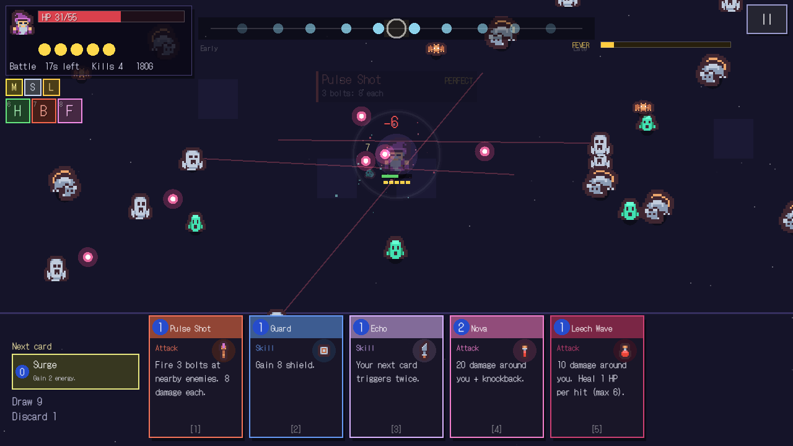
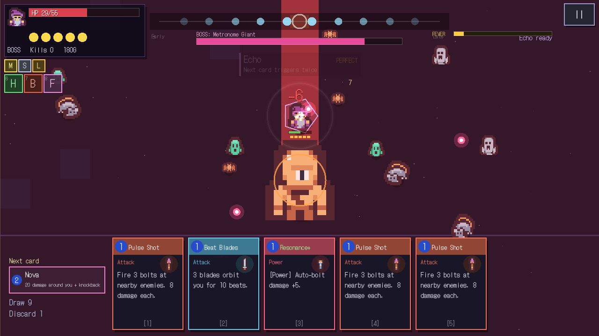
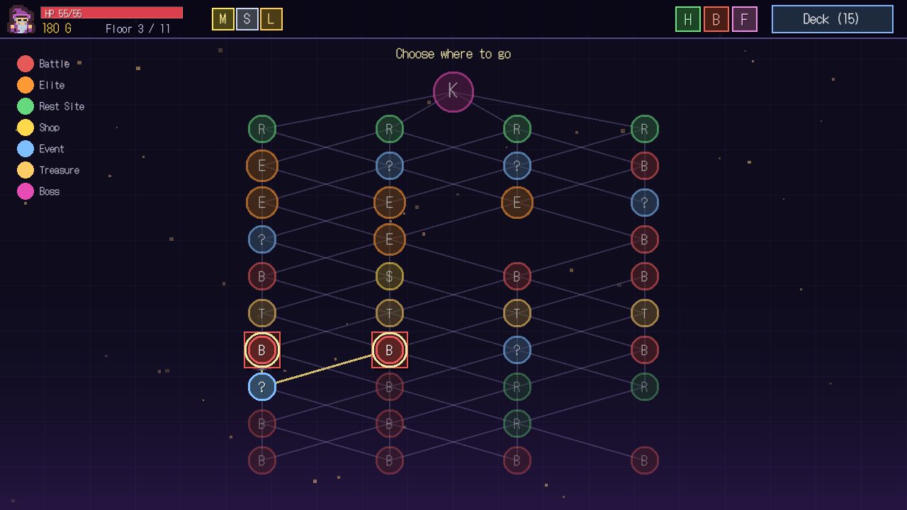
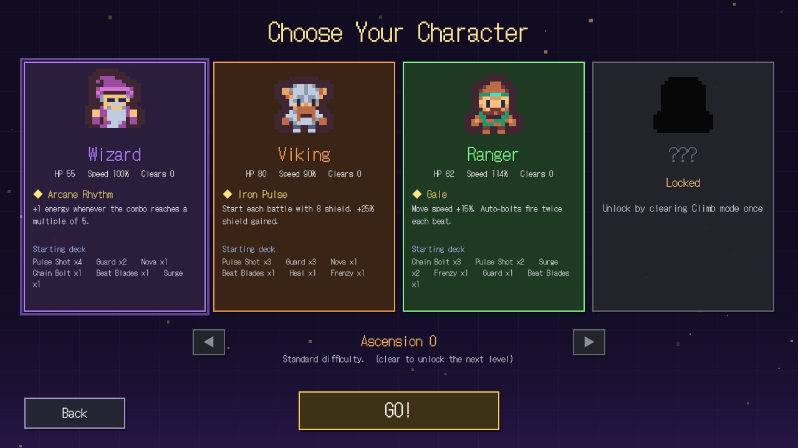
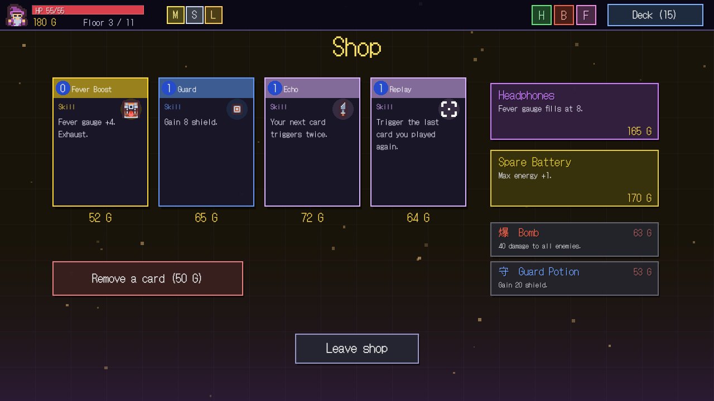
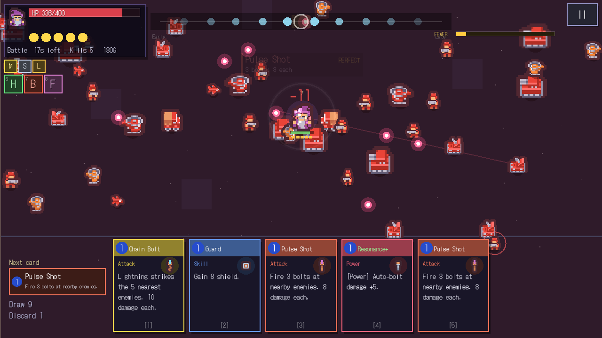

# Beat Deck Survivors

**Play online: https://gentou30.github.io/Beat-Deck-Survivors/**  (keyboard / mouse / touch / gamepad)

A swarm-survival roguelike where your weapons are a **deck of cards** and every card hits harder when played **on the beat**.
*Vampire Survivors* arena fights x *Slay the Spire* run structure x rhythm timing. Built with Godot 4.7 (GDScript).

| | |
|---|---|
|  |  |
|  |  |
|  |  |
|  | |

## How it plays
- Move with **WASD / arrows / left stick / drag**. Enemies swarm you; a weak auto-bolt fires every beat.
- Play cards (**1-5 / A B X Y RB / tap**) as a dot lands on the ring in the top lane. **PERFECT** = x1.5, chain hits for a combo and charge **FEVER**.
- Enemy attacks (bullet rings, charges, slams) are telegraphed **on the beat grid** - read the rhythm to dodge.
- Between fights: pick cards, buy relics/potions, rest/upgrade, take risks at events. Beat one of three bosses.

## Content
- 4 characters (1 unlockable), 27 cards (+ upgrades, powers, exhaust), 18 relics, 6 potions, 5 events
- **2 acts** (10 floors + boss each; Act 2 = a red machine army and the final boss *Maestro* with 3 phases), Endless mode (boss every 10 waves), Daily Run (fixed map + modifier)
- Boss bullet patterns are locked to the beat grid, and the Drum Mage / Maestro also fire on the track's measured off-beat accents
- Ascension 0-5, 18 achievements, records
- 3 CC0 music tracks (BPM-aligned), interactive tutorial, timing calibration, English / Japanese
- Accessibility: reduce flashes/shake, timing assist, adjustable offset; mobile web + gamepad support

## Dev
See [CLAUDE.md](CLAUDE.md) (architecture, test/bot/screenshot commands) and [docs/ROADMAP.md](docs/ROADMAP.md).
Web build: `./tools/export_web.ps1`. GitHub Pages deploys automatically from `main`.

Credits: [assets/CREDITS.md](assets/CREDITS.md) - Kenney (CC0 art/SFX), Joth (CC0 music), DotGothic16 (OFL font).
